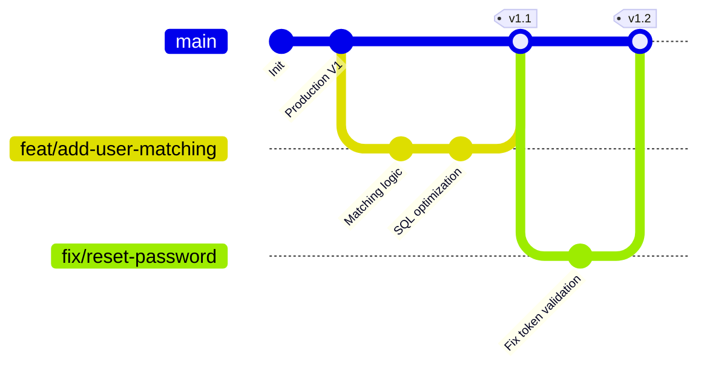

# GitHub Collaboration and Branching Playbook

Welcome to the PairPrep development workflow guide! This playbook outlines how our engineering team collaborates, structures Git branches, manages pull requests, and validates code changes before they reach production.

---

## 1. Trunk-Based Development Model

We follow **Trunk-Based Development (TBD)**. In this model:
* There is only one long-lived branch: `main`.
* Developers check out short-lived feature branches (`feat/*`, `fix/*`) from `main`.
* Features are merged back to `main` as quickly as possible (usually within a day or two) via **Pull Requests (PRs)**.
* Continuous Integration (CI) runs on every push to ensure `main` is always in a deployable, production-ready state.



---

## 2. Branch Naming Conventions

Always use descriptive prefixes when creating new branches from `main`:

| Prefix | Description | Example |
| :--- | :--- | :--- |
| `feat/` | A new feature | `feat/oauth-github` |
| `fix/` | A bug fix | `fix/session-expiry-crash` |
| `refactor/` | Code structure change without behavior changes | `refactor/discovery-sql-query` |
| `chore/` | Dependency updates, config tweaks, CI steps | `chore/upgrade-prisma-client` |
| `docs/` | Documentation improvements | `docs/update-readme` |

---

## 3. Pull Request (PR) Requirements

Before merging any code into the `main` branch, the following conditions must be met:

1. **Local Cleanliness:** Run local checks before pushing:
   ```bash
   npm run lint
   npm run build
   ```
2. **Review Requirement:** Every PR must be reviewed and approved by at least **one peer engineer** (or CODEOWNERS).
3. **CI Validation:** The GitHub Actions pipeline (Lint, Type check, Build, and Tests) must pass successfully.
4. **No Direct Pushes:** Pushing directly to the `main` branch is strictly disabled.

---

## 4. Setting up GitHub Branch Protection (For Admin)

To prevent team members from accidentally pushing to `main` or merging failing code, the repository owner must configure **Branch Protection Rules** on GitHub:

1. Navigate to your repository page on GitHub.
2. Click on the **Settings** tab in the top navigation bar.
3. In the left sidebar, under **Code and automation**, click **Branches**.
4. Click **Add branch protection rule**.
5. Set **Branch name pattern** to `main`.
6. Enable the following checkboxes:
   * **Require a pull request before merging:**
     * Enable **Require approvals** and select at least **1** approval.
   * **Require status checks to pass before merging:**
     * Enable **Require branches to be up to date before merging**.
     * Search for and select the names of the status checks (e.g., `Build & Test`, `Lint & Build`).
   * **Do not allow bypassing the above settings:** Ensure even admins have to pass reviews and CI (encourages team trust).
7. Click **Create** at the bottom of the page to save.
