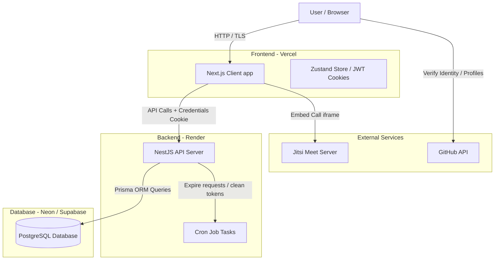

# Deployment & System Architecture Playbook

This document details the system architecture, how the frontend and backend interact, how to host the entire stack for **free**, and how to scale to paid tiers as the product launches to 10k-20k+ users.

---

## 1. System Architecture & Component Interaction

Here is the high-level architecture showing how the Client, API Server, Database, and external services interact:



### Key Interactions:
1. **Frontend to Backend:** The Next.js app communicates with the NestJS API server over HTTPS using JSON. Credentials (session cookies) are sent automatically on cross-origin requests using `credentials: 'include'`.
2. **Session Security:** Access tokens are stored in `HttpOnly` cookies. If they expire, the frontend silent-refresh interceptor automatically requests a refresh token from the `/auth/refresh` API endpoint.
3. **Collaborative Workspace:** When a session begins, both users are directed to the same room. A free Jitsi video iframe is embedded side-by-side with a collaborative scratchpad for coding and note-taking.

---

## 2. Why We Require GitHub Profiles

PairPrep collects users' GitHub profiles during onboarding for several reasons:

1. **Engineering Identity Verification:** Ensures mock interview partners are real, active developers. This prevents spam accounts and builds trust before mock interviews.
2. **Technical Compatibility Matching:** Allows users to view each other's public repositories, languages, and contributions, so they can align mock questions (e.g., matching Java developers with Java interviewers).
3. **Peer trust & Constructive Feedback:** By viewing a partner's profile, interviewers can reference real coding projects to give constructive feedback.

---

## 3. Free Deployment Architecture

You can deploy the entire production stack of PairPrep for **$0 / month** using free-tier providers:

### A. Frontend: Vercel (Next.js)
* **Provider:** [Vercel](https://vercel.com/) (Hobby Plan)
* **Cost:** $0
* **Setup:**
  1. Link your GitHub account to Vercel.
  2. Import the `PairPrep` repository.
  3. Configure the Root Directory to `apps/web`.
  4. Add Environment Variable:
     * `NEXT_PUBLIC_API_URL` = Your backend API URL (e.g. `https://pairprep-api.onrender.com`).
  5. Click Deploy.

### B. Backend: Render (NestJS API)
* **Provider:** [Render](https://render.com/) (Free Web Service)
* **Cost:** $0 (Free instance sleeps after 15 minutes of inactivity; takes ~50s to wake up on the first request).
* **Setup:**
  1. Link GitHub to Render.
  2. Create a **New Web Service**.
  3. Set Root Directory to `apps/api`.
  4. Configure build command: `npm install && npm run build`.
  5. Configure start command: `npm run start:prod`.
  6. Add Environment Variables:
     * `DATABASE_URL` = PostgreSQL connection string (from Neon or Supabase).
     * `JWT_SECRET` = A secure random 32-character string.
     * `NODE_ENV` = `production`
     * `CORS_ORIGINS` = Your frontend URL (e.g. `https://pairprep.vercel.app`).
     * `PORT` = `8080`

### C. Database: Neon or Supabase (PostgreSQL)
* **Provider:** [Neon](https://neon.tech/) (Serverless Postgres) or [Supabase](https://supabase.com/) (Free PostgreSQL Instance).
* **Cost:** $0 (Generous storage and connection limit limits).
* **Setup:**
  1. Create a project on Supabase or Neon.
  2. Copy the Connection String (`postgresql://...`).
  3. Add this string to the `DATABASE_URL` env variable on Render.
  4. Push the schema to the database:
     ```bash
     npx prisma db push
     ```

---

## 4. Scaling to a Paid Launch (10k-20k Users)

When you launch to 10k-20k+ users, you must migrate from free tiers to paid resources to prevent performance throttling and instance sleep:

1. **Prevent Backend Sleep (Render Starter):** Upgrade the backend service on Render to the **Starter** ($7/month) or **Standard** ($15/month) plan. This ensures the NestJS API is always awake and ready to handle incoming matching requests instantly.
2. **Production Database Compute (Neon/Supabase Paid):** Upgrade the database to Neon's Launch Plan ($19/mo) or Supabase Pro ($25/mo) to get dedicated CPU, autoscaling database storage, automated backups, and higher concurrent connection limits.
3. **Frontend CDN Scale:** Vercel's free hobby plan easily handles 20k+ users due to Vercel's global edge network (CDN), but upgrading to Vercel Pro ($20/month per seat) provides unlimited bandwidth and commercial compliance.
